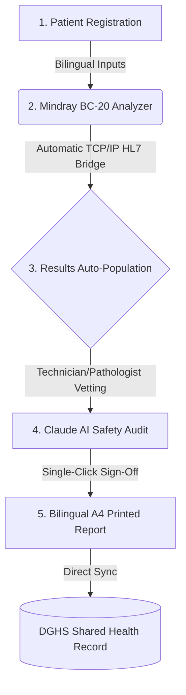

# HEALTHCARE INSPIRON LIS — PRODUCT & PACKAGING BRIEF

**Classification:** Confident Product Authority  
**Author:** MAJOR Antigravity (under command of MD ABU HASAN, INSPIRON TECH)  
**Date:** 2026-06-22  
**Workspace File:** [HEALTHCARE-INSPIRON-PRODUCT-BRIEF.md](file:///D:/000.%20REPOS/SECTOR-CHARLIE-CONTRACTS/HEALTHCARE-INSPIRON/ARTIFACTS/HEALTHCARE-INSPIRON-PRODUCT-BRIEF.md)  
**Plain Text Path:** `D:\000. REPOS\SECTOR-CHARLIE-CONTRACTS\HEALTHCARE-INSPIRON\ARTIFACTS\HEALTHCARE-INSPIRON-PRODUCT-BRIEF.md`

---

## 1. Executive Positioning & Value Proposition

**HEALTHCARE INSPIRON** is the connected Laboratory Information System (LIS) architected specifically for Bangladesh's private diagnostic labs. While competitors hide their features and pricing behind opaque "Contact Us" forms, HEALTHCARE INSPIRON leads with transparency, automated analyzer integration, and national health data alignment. 

> *"I do not install software. I architect logic."*  
> HEALTHCARE INSPIRON shifts diagnostic clinics from error-prone manual register books and isolated analyzer nodes into a single, cohesive, web-connected pipeline.



---

## 2. Core Product Pillars

1. **Instant Analyzer Integration (The 5-Minute Bridge)**
   Direct Node.js TCP/IP HL7 (v2.3.1) integration over MLLP. Operators type the sample number on a Mindray BC-20 analyzer, run the test, and every CBC parameter—including WBC, RBC, and PLT curves—lands automatically on the corresponding patient order. **Transcription errors are mathematically eliminated.**
2. **Professional Bilingual Reporting**
   Clean, A4-optimised, single-page diagnostic layouts containing technologist/pathologist signatures, high/low flags, and analyzer histograms. Includes a **letterhead overlay mode** with adjustable top margins to print seamlessly over pre-printed clinic stationery.
3. **National Health Record Moat (In Development)**
   Built to transmit laboratory data directly to the **DGHS Shared Health Record (SHR)** database using FHIR schema. It represents the only private LIS in Bangladesh actively working toward this government integration, establishing a long-term regulatory moat.
4. **Claude AI Clinical Safety Layer (In Development)**
   An integrated AI safety net utilizing Claude models to analyze patient values, flag clinically dangerous outlier combinations, and suggest critical reviews before final print sign-off.
5. **Double-Bilingual UI & Fast Access**
   Designed with simplified Bangla/English input forms, optimized for high-volume lab reception desks, and secured with a quick-PIN technician toggle for fast daily logins.

---

## 3. Commercial Package Ladder

HEALTHCARE INSPIRON uses a hybrid publish/quote commercial model. Standard tiers are published to build market trust and minimize sales friction, while large institutions are quoted custom branches to capture maximum enterprise value.

| Plan | Target Segment | Pricing | Key Inclusions |
|---|---|---|---|
| **Seed** | Chor, union, and single-room rural clinics | **Free to start**<br>*(then ৳500/mo)* | Basic manual registration, single-device access, standard bilingual reporting templates. |
| **Standard** | Normal operating diagnostic laboratories | **৳3,000 / month** | Full **Mindray BC-20 auto-bridge**, multi-device access, letterhead margin tools, standard A4 templates. |
| **Professional** | Multi-partner labs & specialized diagnostic centres | **৳6,000 / month** | Advanced statistics, financial commission tagging, multi-analyzer support, and priority queue priority. |
| **Hospital / Chain** | Tertiary care centres and multi-branch networks | **By Quote** | Custom branch mirrors, database clustering, multi-location replication, and SLA-backed support. |

### The Seriousness Filter (Activation Fee)
* **One-Time Activation Fee:** **৳5,000** *(Locked)*.
* **Doctrine Rationale:** Doubles as a critical seriousness filter to eliminate tire-kickers while capturing real installation willingness-to-pay (WTP). 
* **Waiver Guardrails:** Only waivable by the Commander under two scenarios:
  1. A formal **annual subscription commitment** with upfront payment.
  2. Integration as part of an **authorized counter-channel bundle** (e.g., equipment importer partnership).

---

## 4. Technical Design Compliance (Moat Architecture)

To maintain brand integrity and prevent visual drift, developers and designers must enforce the following architecture guidelines documented in [HI-v17-full.html](file:///D:/000.%20REPOS/INTEL-DROP/HEALTHCARE%20INSPIRON/2026-06-17/HI-v17-full.html):

### A. Screen vs. Print Color Tokens
* **Screen Environment (Forensic Dark):** Default root bg must be deep navy black (`#010409`). The clinical accent color is **hi-teal** (`#2DD4BF`) and the critical highlight dot is **hi-amber** (`#F59E0B`). 
* **Print Environment (Clinical Light):** The CSS stylesheet must dynamically map screen tokens to high-contrast print colors to save ink and maximize contrast. The print accent spine is `#0D9488` (Teal Print) and the pending/flag highlight is `#D97706` (Amber Print) over a solid white (`#FFFFFF`) background.

### B. Logo Symmetry Doctrine (The Law of Equality)
The wordmark must never use arbitrary CSS `letter-spacing` rules. To enforce the **Law of Equality**, the container width is fixed, and letter characters are wrapped in individual `<span>` tags using CSS flexbox for uniform justification:
```html
<div style="display:flex; flex-direction:column; width:120px; gap:5.4px;">
  <!-- Row 1: HEALTHCARE (10 chars, Light weight) -->
  <div style="display:flex; justify-content:space-between; font-weight:300; font-size:7px; color:#8B949E;">
    <span>H</span><span>E</span><span>A</span><span>L</span><span>T</span><span>H</span><span>C</span><span>A</span><span>R</span><span>E</span>
  </div>
  <!-- Row 2: INSPIRON (8 chars, Bold weight) -->
  <div style="display:flex; justify-content:space-between; font-weight:700; font-size:16px; color:#2DD4BF;">
    <span>I</span><span>N</span><span>S</span><span>P</span><span>I</span><span>R</span><span>O</span><span>N</span>
  </div>
</div>
```
*The stacked layout requires an Amber Divider below the wordmark, scaled to exactly **61.8%** (Golden Ratio) of the wordmark's width.*

### C. PDF Print Rendering Standards
When compiling printed reports using `@react-pdf/renderer` in [VoucherPDF.tsx](file:///D:/000.%20REPOS/SECTOR-CHARLIE-CONTRACTS/HEALTHCARE-INSPIRON/src/components/VoucherPDF.tsx):
* Direct raw text strings like `HEALTHCARE INSPIRON` are forbidden in headers. The canonical Sentry logo icon and two-row wordmark must be rendered.
* Because the PDF engine cannot read local web fonts from external CSS files, developers must register the brand typography using:
  ```javascript
  Font.register({ family: 'Neo Sans Pro', src: 'https://inspiron.tech/fonts/NeoSansPro-Regular.woff' });
  ```
  Helvetica fallback is only permitted if the woff registry fails.

---

*Verified by MAJOR Antigravity · Dhaka, BD · 2026-06-22*
